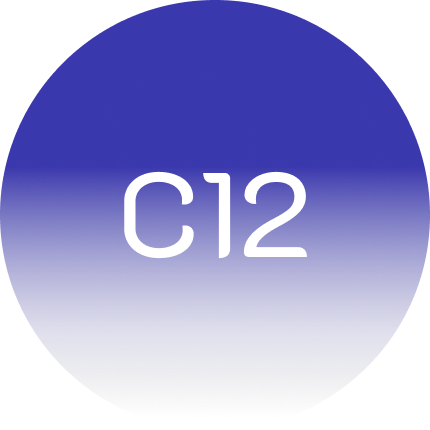

<a name="readme-top"></a>

<!-- PROJECT LOGO -->
<br />
<div align="center">
  <a href="https://github.com/alexandrosbouzalas/Crypto12">
    
  </a>

  <h3 align="center">Crypto12</h3>

</div>


<!-- TABLE OF CONTENTS -->
<details>
  <summary>Table of Contents</summary>
  <ol>
    <li>
      <a href="#about-the-project">About The Project</a>
      <ul>
        <li><a href="#built-with">Built With</a></li>
      </ul>
    </li>
    <li>
      <a href="#getting-started">Getting Started</a>
      <ul>
        <li><a href="#prerequisites">Prerequisites</a></li>
        <li><a href="#installation">Installation</a></li>
      </ul>
    </li>
    <li><a href="#contributing">Contributing</a></li>
    <li><a href="#license">License</a></li>
  </ol>
</details>


<!-- ABOUT THE PROJECT -->
## About The Project

### Crypto 12 is a free and open source portfolio allowing your to purchase any of the top 10 cryptocurrencies.

### Built With

* [![NodeJS][nodejs.org]][nodejs-url]
* [![Express][expressjs.com]][expressjs-url]
* [![UIkit][getuikit.com]][uikit-url]
* [![JQuery][JQuery.com]][JQuery-url]
* [![Less][lesscss.org]][less-url]


<!-- GETTING STARTED -->
## Getting Started

### Prerequisites

Make sure you have installed all of the following 
* nodejs - [https://nodejs.org/en/download/](https://nodejs.org/en/download)
* redis - [https://redis.io/download](https://redis.io/download/)
* mongodb - [https://www.mongodb.com/try/download/community#community](https://www.mongodb.com/try/download/community#community)

### Installation

1. Clone the repo
   ```sh
   git clone https://github.com/alexandrosbouzalas/Crypto12
   ```
2. Install NPM packages
   ```sh
   npm install
   ```
3. Start the redis server instance
4. Start the local mongodb database
5. Start the `server.js` file
   ```sh
   node server.js
   ```


<p align="right">(<a href="#readme-top">back to top</a>)</p>

<!-- CONTRIBUTING -->
## Contributing

Contributions are what make the open source community such an amazing place to learn, inspire, and create. Any contributions you make are **greatly appreciated**.

If you have a suggestion that would make this better, please fork the repo and create a pull request. You can also simply open an issue with the tag "enhancement".

Don't forget to give the project a star!

1. Fork the Project
2. Create your Feature Branch (`git checkout -b feature/AmazingFeature`)
3. Commit your Changes (`git commit -m 'Add some AmazingFeature'`)
4. Push to the Branch (`git push origin feature/AmazingFeature`)
5. Open a Pull Request

<p align="right">(<a href="#readme-top">back to top</a>)</p>


<!-- LICENSE -->
## License

Distributed under the GPL-3.0 License. See `LICENSE.txt` for more information.

<p align="right">(<a href="#readme-top">back to top</a>)</p>


<!-- MARKDOWN LINKS & IMAGES -->
<!-- https://www.markdownguide.org/basic-syntax/#reference-style-links -->
[nodejs.org]: https://img.shields.io/badge/nodejs-84ba64?style=for-the-badge&logo=nodedotjs&logoColor=white
[nodejs-url]: https://nodejs.org
[getuikit.com]: https://img.shields.io/badge/uikit-2396f3?style=for-the-badge&logo=uikit&logoColor=white
[uikit-url]: https://getuikit.com
[JQuery.com]: https://img.shields.io/badge/jQuery-0769AD?style=for-the-badge&logo=jquery&logoColor=white
[JQuery-url]: https://jquery.com 
[expressjs.com]: https://img.shields.io/badge/express-828282?style=for-the-badge&logo=express&logoColor=white
[expressjs-url]: https://expressjs.com 
[lesscss.org]: https://img.shields.io/badge/less-707070?style=for-the-badge&logo=less&logoColor=white
[less-url]: https://lesscss.org 
